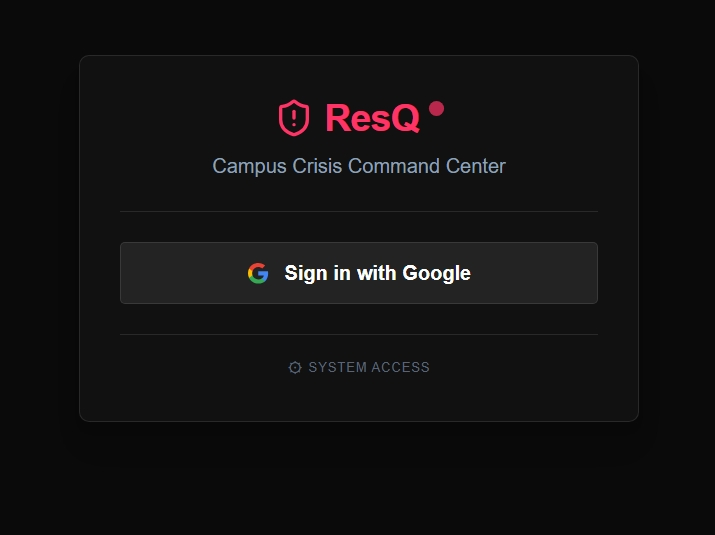

<div align="center">



<br/>
<br/>


<br/>
<br/>

**ResQ** is an AI-powered campus crisis command center that coordinates
emergency response across reporters, responders, and administrators —
in real time, in any language.

[Live Demo](#) · [Report Bug](#) · [Request Feature](#)

</div>

---

## 🔴 The Problem

When an emergency hits a college campus — a student collapses,
a fire breaks out, a pipe bursts — the response is chaos.
People call the wrong person. No one knows who is available.
There is no priority system. By the time the right team reaches
the spot, critical minutes are lost.

**ResQ solves this.**

---

## ⚡ What ResQ Does

A reporter submits an incident in seconds →
**Gemini AI triages it instantly** →
The right responder is notified and assigned →
Admin monitors everything live on a tactical command dashboard →
Every incident is logged, summarised, and resolved with an AI closure report.

All of this happens in **under 10 seconds.**

---

## 🎯 Key Features

### 🛡️ Role-Based Access Control
Three completely separate interfaces — each role sees only
what they need.

| Role | What They See |
|---|---|
| **Reporter** | Incident submission form + status of their own reports |
| **Responder** | Assigned incidents + AI instructions + multilingual support |
| **Admin** | Full tactical dashboard + live map + AI chat assistant |

### 🗺️ Tactical Command Dashboard
- Live map with glowing incident markers via **Leaflet**
- Real-time scrolling alert ticker for active critical incidents
- Bento-grid layout with animated stat cards
- Threat Vectors bar chart + Incidents Last 24H line chart
- Active Personnel Roster with live availability status
- Powered by **Framer Motion** for smooth tactical animations

### 🧠 Gemini AI Integration
- **Instant triage** — severity, type, response instructions
  generated in under 3 seconds
- **AI Chat Assistant** — admin can ask *"summarise active
  incidents"* or *"which area has the most threats today"*
- **Auto-drafted alert messages** for WhatsApp/SMS approval
- **AI Closure Reports** — auto-generated when incident resolves
- **Real-time translation** into 6 languages for responders

### 🌐 Multilingual Responder Interface
Responders can read and hear incident details in their
preferred language — powered entirely by Gemini API
and Web Speech API.

Supported languages:
`English` `Malayalam` `Hindi` `Tamil` `Kannada` `Arabic`

### 🔊 Accessibility & Alerts
- Text-to-Speech reads incident details aloud in selected language
- Critical sound alert (Web Audio API) when new critical
  incident arrives
- Browser tab flashes on critical alert
- Mute toggle for alert sounds

### 📊 Analytics & Reporting
- Live incident counts by severity and status
- 24-hour incident trend line chart
- Incident type distribution (Threat Vectors)
- AI-generated closure reports saved to Firestore

---

## 🛠️ Tech Stack

**Frontend**
- React 19 + Vite
- Tailwind CSS v4
- Framer Motion
- React Leaflet
- Google Generative AI SDK (Gemini 1.5 Flash)
- React Google Charts
- Lucide React

**Backend**
- Node.js + Express
- Firebase Admin SDK
- Nodemailer

**Google Products Used**
- Firebase Authentication
- Cloud Firestore
- Firebase Hosting
- Firebase Cloud Messaging
- Firebase Analytics
- Google Gemini 1.5 Flash API
- Google Maps / Leaflet

---

## 📁 Project Structure

```
developer-prgm/
├── resq/                     # Frontend — React + Vite
│   ├── src/
│   │   ├── components/       # Reusable UI components
│   │   ├── pages/
│   │   │   ├── Login.jsx     # Role selection + Google Auth
│   │   │   ├── Report.jsx    # Reporter interface
│   │   │   ├── Responder.jsx # Responder interface
│   │   │   └── Dashboard.jsx # Admin tactical command
│   │   ├── services/
│   │   │   ├── firebase.js   # Firebase init + config
│   │   │   └── gemini.js     # Gemini API calls
│   │   └── hooks/            # Custom React hooks
│   └── .env                  # Frontend environment variables
│
└── resq-backend/             # Backend — Node.js + Express
    ├── index.js              # Express server entry point
    └── .env                  # Backend environment variables
```

---

## 🚦 Getting Started

### Prerequisites
- Node.js v18 or higher
- A Firebase project with Firestore + Authentication enabled
- Google Gemini API key from [aistudio.google.com](https://aistudio.google.com)

### 1. Clone the Repository

```bash
git clone <repository-url>
cd developer-prgm
```

### 2. Setup the Backend

```bash
cd resq-backend
npm install
```

Create a `.env` file in `/resq-backend`:

```env
FIREBASE_PROJECT_ID=your_project_id
FIREBASE_PRIVATE_KEY=your_private_key
FIREBASE_CLIENT_EMAIL=your_client_email
EMAIL_USER=your_email@gmail.com
EMAIL_PASS=your_app_password
PORT=3001
```

### 3. Setup the Frontend

```bash
cd ../resq
npm install
```

Create a `.env` file in `/resq`:

```env
VITE_FIREBASE_API_KEY=your_key
VITE_FIREBASE_AUTH_DOMAIN=your_project.firebaseapp.com
VITE_FIREBASE_PROJECT_ID=your_project_id
VITE_FIREBASE_STORAGE_BUCKET=your_project.appspot.com
VITE_FIREBASE_MESSAGING_SENDER_ID=your_sender_id
VITE_FIREBASE_APP_ID=your_app_id
VITE_GEMINI_API_KEY=your_gemini_api_key
VITE_GOOGLE_MAPS_API_KEY=your_maps_api_key
```

### 4. Run the Application

**Start the backend:**
```bash
cd resq-backend
node index.js
```

**Start the frontend:**
```bash
cd resq
npm run dev
```

Open [http://localhost:5173](http://localhost:5173) in your browser.

---

## 👥 User Roles & Demo

For a quick demo, use the built-in **"Load Demo Data"** button
on the admin dashboard to populate Firestore with realistic
campus incidents, responders, and users instantly.

| Role | Access | Demo Account |
|---|---|---|
| Admin | Full dashboard + AI chat | Hardcoded email or secret code |
| Responder | Assigned incidents only | Create via role selection |
| Reporter | Report form + own incidents | Create via role selection |

**Admin secret code:** `RESQ2025`
*(Enter via the ⚙ System Access link on the role selection screen)*

---

## 📸 Screenshots

| Tactical Command Dashboard | Report Incident | Responder View |
|---|---|---|
|  |  |  |

---

## 🏗️ Built For

**Google Developers Virtual Hackathon**
Track: Rapid Crisis Response — Open Innovation
Built solo by **Lakshmi Anoop** in 3 days using
Firebase Studio (Antigravity) + AI-assisted development.

---

## 📄 License

This project is licensed under the MIT License.

---

<div align="center">

Built with ❤️ using Google Firebase, Gemini AI, and React

⭐ Star this repo if you found it useful!

</div>